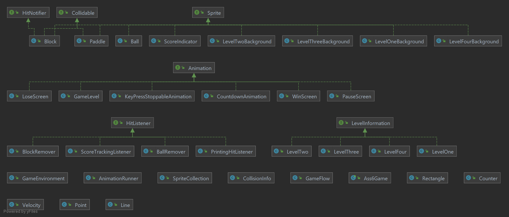

# Arkanoid

## Features
The game has 4 levels:

Level 1: 
Level 2: 
Level 3: 
Level 4: 

If no arguments were given it starts with 1 then 2, 3 and 4, you can choose which level to do by giving the level number as an argument,
you can also give multiple arguments between 1 to 4 to choose the order you want to do the levels.  
you can control the paddle with the right and left arrows on your keyboard, and also pause the game using the key p.

## Directories
src - contains the source code of the game.  
biuoop-1.4.jar - a package used in the code that contains GUI, DrawSurface and Sleeper.  

### UML

